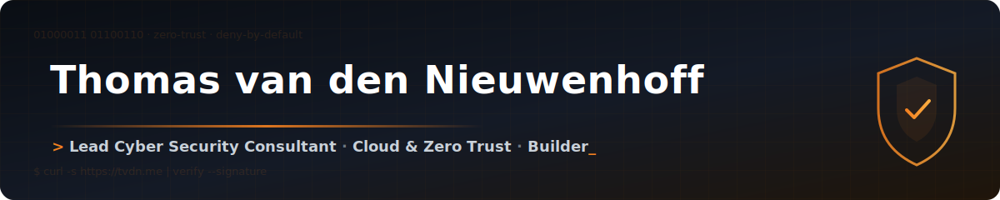

<!-- ╔═══════════════════════════════════════════════════════════════════╗ -->
<!-- ║                          HERO / HEADER                            ║ -->
<!-- ╚═══════════════════════════════════════════════════════════════════╝ -->

<div align="center">



<a href="https://tvdn.me">
  
</a>

<br />

[](https://tvdn.me)
[](https://www.linkedin.com/in/tvdn)
[](https://wa.me/message/XLBMO7NODAYRP1)
[](https://github.com/ThomasIAm)

</div>

<!-- ╔═══════════════════════════════════════════════════════════════════╗ -->
<!-- ║                            WHOAMI                                 ║ -->
<!-- ╚═══════════════════════════════════════════════════════════════════╝ -->

## `> whoami`

```bash
thomas@tvdn:~$ whoami --verbose

  Name        : Thomas van den Nieuwenhoff
  Role        : Lead Cyber Security Consultant @ SALT Cyber Security 
  Focus       : Zero Trust · Cloudflare · Cloud security · OpenShift
  Mission     : Helping businesses thrive — and stay safe — in the digital world
  Currently   : Building apps & tools with AI as an effective co-pilot
  Open to     : Companies that need a cyber security expert (or want to know why they do)

thomas@tvdn:~$ _
```

<!-- ╔═══════════════════════════════════════════════════════════════════╗ -->
<!-- ║                        CERTIFICATIONS                             ║ -->
<!-- ╚═══════════════════════════════════════════════════════════════════╝ -->

## `> ls ./certifications`

<div align="center">

[][cf1a]
[][cfasa]
[][ex280]
[][do380]

<sub>Cloudflare **Architect** · **Zero Trust** · **App Sec**  ·  Red Hat OpenShift **Architect** · **Admin**</sub>

</div>

<!-- ╔═══════════════════════════════════════════════════════════════════╗ -->
<!-- ║                         TECH ARSENAL                              ║ -->
<!-- ╚═══════════════════════════════════════════════════════════════════╝ -->

## `> cat ./tech-arsenal`

**🛡️ Security & Cloud**


**⚙️ Infra & DevOps**


**💻 Development**


<!-- ╔═══════════════════════════════════════════════════════════════════╗ -->
<!-- ║                       FEATURED PROJECTS                           ║ -->
<!-- ╚═══════════════════════════════════════════════════════════════════╝ -->

## `> git log --featured`

<table>
<tr>
<td width="50%" valign="top">

#### 🔐 [cloudflare-dlp-forensic-copy-decoder](https://github.com/Devolvio-B-V/cloudflare-dlp-forensic-copy-decoder)

CLI + interactive TUI to decode & extract Cloudflare DLP forensic copies from compressed logs.

[](https://github.com/Devolvio-B-V/cloudflare-dlp-forensic-copy-decoder/stargazers)


</td>
<td width="50%" valign="top">

#### 🛰️ [portfolio-vite](https://github.com/ThomasIAm/portfolio-vite)

Personal portfolio, built with Vite + React + TypeScript.

[](https://github.com/ThomasIAm/portfolio-vite/stargazers)


</td>
</tr>
<tr>
<td width="50%" valign="top">

#### 🖥️ [VM2Portaal](https://github.com/ThomasIAm/VM2Portaal)

The frontend for a simple cloud portal.

[](https://github.com/ThomasIAm/VM2Portaal/stargazers)


</td>
<td width="50%" valign="top">

#### ⚙️ [VM2](https://github.com/ThomasIAm/VM2)

Ansible implementation powering a custom cloud portal (VM2Portaal).

[](https://github.com/ThomasIAm/VM2/stargazers)


</td>
</tr>
<tr>
<td width="50%" valign="top">

#### ⛰️ [Young-Mountaineers](https://github.com/ThomasIAm/Young-Mountaineers)

Backoffice + public portfolio webapp built with Mendix.

[](https://github.com/ThomasIAm/Young-Mountaineers/stargazers)


</td>
<td width="50%" valign="top">

#### 😅 [benikincapabel.nl](https://github.com/ThomasIAm/benikincapabel.nl)

The site behind benikincapabel.nl — a joke gone wrong.

[](https://github.com/ThomasIAm/benikincapabel.nl/stargazers)


</td>
</tr>
</table>

<!-- ╔═══════════════════════════════════════════════════════════════════╗ -->
<!-- ║                            STATS                                  ║ -->
<!-- ╚═══════════════════════════════════════════════════════════════════╝ -->

## `> gh stats`

<div align="center">

[](https://github.com/ThomasIAm?tab=followers)
[](https://github.com/ThomasIAm?tab=repositories)
[](https://gist.github.com/ThomasIAm)

</div>

<!-- ╔═══════════════════════════════════════════════════════════════════╗ -->
<!-- ║                            OUTRO                                  ║ -->
<!-- ╚═══════════════════════════════════════════════════════════════════╝ -->

<div align="center">
<br />

### `> Let's connect`

**Looking for cyber security expertise — or wondering why it matters?**
Let's talk. 👇

[](https://tvdn.me/contact)


</div>

<!-- ╔═══════════════════════════════════════════════════════════════════╗ -->
<!-- ║                           REFERENCES                              ║ -->
<!-- ╚═══════════════════════════════════════════════════════════════════╝ -->

[salt]: https://salt-security.com
[website]: https://tvdn.me
[linkedin]: https://www.linkedin.com/in/tvdn
[whatsapp]: https://wa.me/message/XLBMO7NODAYRP1
[cf1a]: https://university.cloudflare.com/credential/verify/8af04ea4-8023-4889-bbb3-e7b8a16343ba
[cfasa]: https://university.cloudflare.com/credential/verify/a52c3432-e2a9-445b-9ee6-e01e63484116
[ex280]: https://www.credly.com/badges/18f84f10-92f3-4667-9641-2eaa96ad23a4/public_url
[do380]: https://www.credly.com/badges/d8cb9547-4229-4a5b-94ed-df8bcc30c909/public_url
